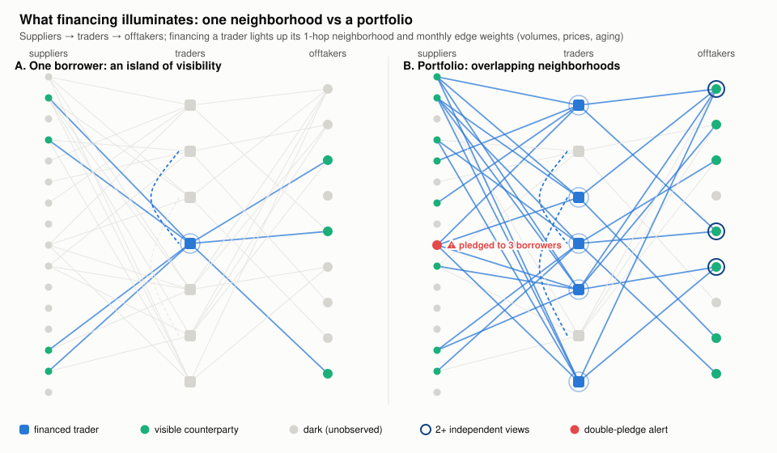
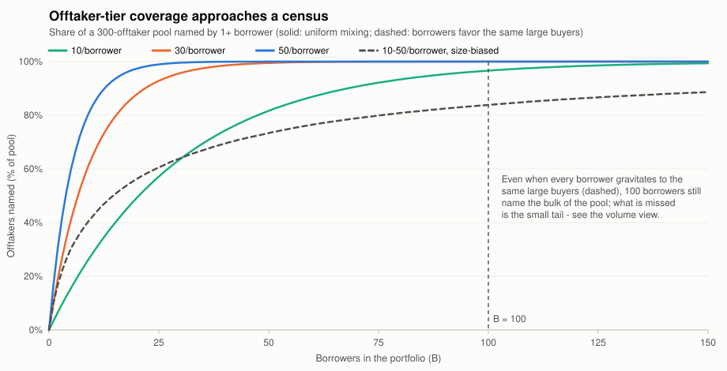
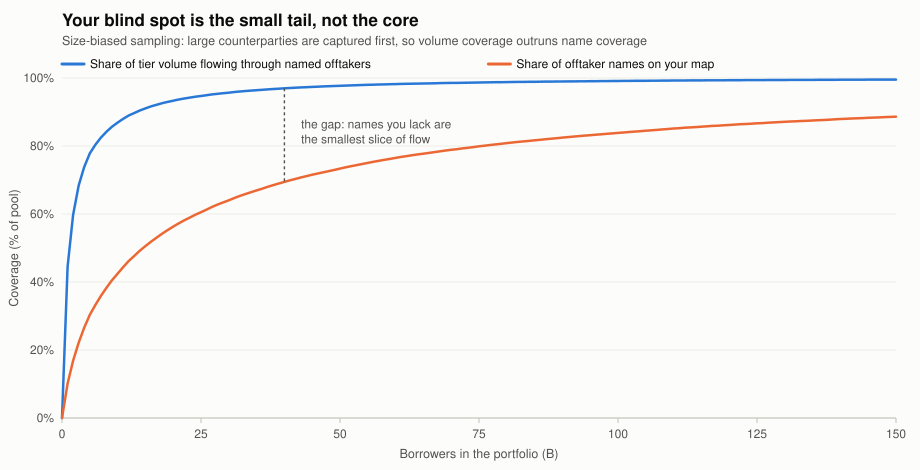
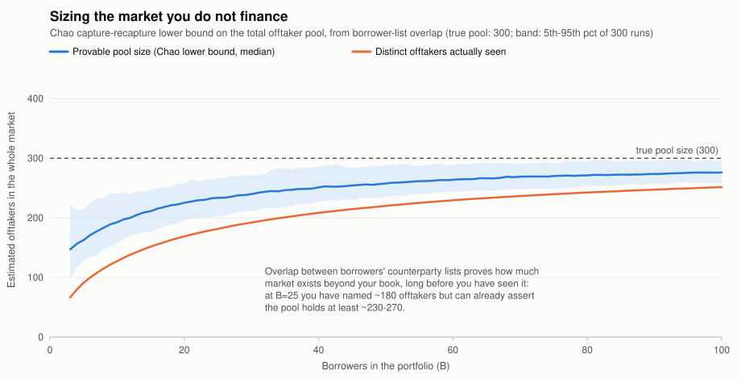
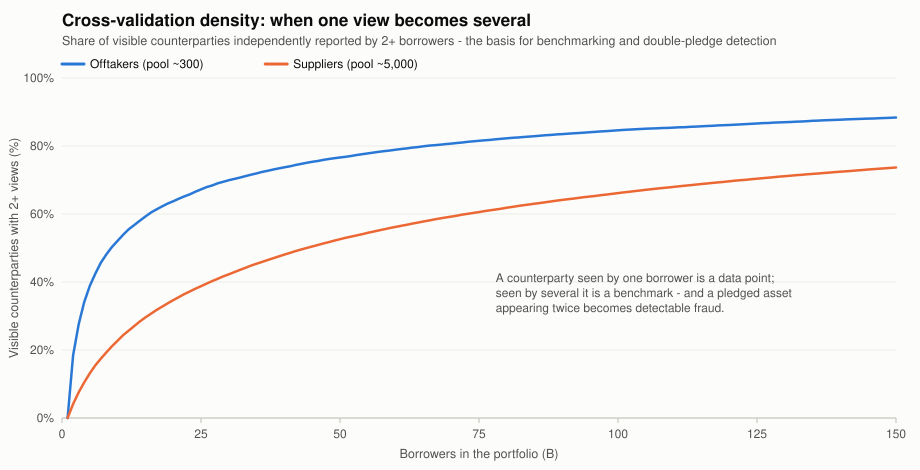

# Borrowing-base lending as a market-observation instrument: a graph model

A borrowing-base lender to commodity traders is not just a credit provider.
Structurally, the lender occupies an observation point that no market participant can occupy, and the value of that point scales super-linearly in the number of borrowers.
This note defines a commodity-agnostic model that turns "we finance many traders" into precise, defensible assertions about market penetration and market knowledge, quantifies what changes between financing 1 borrower and 100, and derives the commercial consequences — including how a credit-insurance strategy converts the information advantage into a competitive advantage for the borrowers themselves.

All figures are generated by [`figures/bb_figures.py`](figures/bb_figures.py) (pure Python, seeded, no dependencies); the stylized parameters — a ~300-name offtaker tier, 10–50 offtakers and 50–200 suppliers per mid-size trader — are the ones from the motivating discussion and are inputs, not conclusions.

## 1. The model

The model has three layers: the market as it exists, the part of it you observe, and the inferences the observed part licenses about the rest.
Nothing in it references a specific commodity; a commodity instance is just a parameter vector.

### Layer 0 — the latent market graph

For a commodity $c$, let the market in month $t$ be a weighted directed graph

$$G_t = (U, E_t), \qquad U = S \cup T \cup O$$

- $S$ — **suppliers**: origin-side sellers (cooperatives, estates, aggregators, local traders).
- $T$ — **traders**: the merchant tier, i.e. the universe from which borrowers are drawn.
- $O$ — **offtakers**: destination-side buyers (processors, industrial consumers, majors).

Edges run $S \to T$, $T \to O$, and $T \to T$ (traders trade among each other), so the graph is tripartite-with-a-core rather than strictly bipartite; a node's tier is its role in the flow, and one legal entity may hold roles in two tiers.
A supplier may sell to many traders and an offtaker may buy from many, so edges are many-to-many.

Every edge $e$ carries a **weight vector**, not a mere existence bit:

$$w_t(e) = \big(q,\; p,\; \tau,\; a,\; r\big)$$

volume, unit price, payment terms, receivables aging, and route/grade metadata.
The commodity instance is the parameter vector $\theta_c = (Q_c,\; N_S,\; N_O,\; \text{degree and size distributions})$, where $Q_c$ is global annual flow (≈5 Mt for cocoa, ≈10 Mt for coffee) and $N_O$, $N_S$ are the (unknown) tier sizes.
Everything below is a statement about $G_t$ and $\theta_c$, which is what makes the model commodity-agnostic.

### Layer 1 — the observation operator (what financing buys you)

Financing borrower $b \in T$ illuminates the **closed 1-hop neighborhood** $N[b]$: the node $b$, its supplier set $S_b$, its offtaker set $O_b$, and every incident edge.
Crucially, the monthly borrowing-base certificate does not just reveal that these edges exist — it reveals their **weights**, invoice by invoice, time-stamped, at audit grade: the receivables ledger quantifies each $b \to O$ edge (price, volume, tenor, aging), inventory quantifies the node's stock, and supplier prepayments/payables quantify each $S \to b$ edge.

For a portfolio $P = \{b_1, \dots, b_B\}$, the **visible graph** is

$$V(P) = \bigcup_{i=1}^{B} N[b_i]$$

with observed weight panels $\{w_t(e)\}$ on every visible edge, monthly.
What stays dark: edges between two non-financed nodes, and anything beyond one hop.
A mid-size trader has ~50–200 suppliers and ~10–50 offtakers, so each borrower contributes roughly 100–250 counterparties plus the quantified flows across them.



### Layer 2 — metrics and estimators (what the observed part licenses)

Five quantities turn $V(P)$ into assertable market knowledge.

1. **Volume penetration** — directly measured, no estimation needed:
   $$\pi = \frac{\sum_{b \in P} q_b}{Q_c}$$
   the share of global flow that physically crosses your financed balance sheets.
   With 100 mid-size borrowers at ~25 kt each, $\pi \approx 50\%$ of a 5 Mt cocoa market or ~25% of a 10 Mt coffee market — but the model treats throughput and $Q_c$ as inputs and $\pi$ as the output.
2. **Tier coverage** — $C_X = |X \cap V(P)| / N_X$ for each tier $X \in \{S, T, O\}$, i.e. the share of counterparty *names* on your map.
3. **Pool-size estimation (capture–recapture)** — each borrower's counterparty list is an independent "capture occasion", so overlap between lists estimates the tier size you *cannot* see.
   Pairwise, Lincoln–Petersen gives $\hat{N} = n_A n_B / m$ for two borrowers naming $n_A$ and $n_B$ offtakers with $m$ in common; with $B$ occasions and heterogeneous capture (big offtakers are named more often), use the Chao estimator
   $$\hat{N}_{\text{Chao}} = D + \frac{f_1(f_1 - 1)}{2(f_2 + 1)}$$
   where $D$ is distinct names seen and $f_k$ is the count of names seen by exactly $k$ borrowers.
   Under strong size bias, $\hat{N}_{\text{Chao}}$ is a **lower bound** — which is exactly the right shape for a defensible claim: "the pool contains *at least* $\hat{N}$ names, of which we see $D$."
4. **Cross-validation density** — $\rho$ = share of visible counterparties reported independently by ≥2 borrowers.
   One view is a data point; two or more views make a benchmark, and make a double-pledged asset detectable.
5. **Structural position** — in the *information* graph (who can see which flows), competing traders are disconnected: no trader sees a rival's book, a supplier sees only its own buyers, an offtaker only its own vendors.
   The lender is adjacent to every financed trader and is therefore the unique node whose view spans otherwise disconnected competitive components — the highest-betweenness observation point, formally the node bridging the most structural holes (in Burt's sense) in the market's information topology.

## 2. What changes between 1 borrower and 100

With one borrower you hold a perfect record of a single firm and no way to tell whether its prices, terms, or counterparty behavior are normal or aberrant — there is no distribution to locate it in.
Each additional borrower does two things at once: it adds a neighborhood to $V(P)$, and it adds an *independent* capture occasion that overlaps the others.
The first effect grows your map; the second is what converts the map into knowledge.

| Dimension | 1 borrower | 100 borrowers | Mechanism |
|---|---|---|---|
| Offtaker map | 10–50 names | approaching a census of the tier | coupon-collector saturation (fig. below) |
| Benchmark | none — no reference distribution | cross-sectional distribution of price/terms per route, grade, tenor | overlap: $\rho \to$ high |
| The unseen market | unknowable | bounded from below, with uncertainty quantified | capture–recapture |
| Shock identification | idiosyncratic vs systematic are confounded | decomposable: common factor (route/origin/market) vs borrower residual | panel across borrowers |
| Fraud | double-pledging invisible | detectable wherever two collateral pools intersect | multi-view of suppliers |
| Market timing | one book's lag | leading indicators: synchronized inventory build, margin compression on a route | portfolio-synchronous signals |
| Counterparty credit | one aging ledger | a payment-behavior panel per offtaker across many creditors | the "private bureau" (§5) |

The saturation mechanism is the concentration of the offtaker tier.
If each borrower names $k$ of $N_O \approx 300$ offtakers roughly uniformly, expected coverage is $1 - (1 - k/N_O)^B$; at $k = 30$, $B = 100$ that is 99.997% — a census.
The honest version keeps the size bias (every borrower gravitates to the same large buyers): simulated with a heavy-tailed pool and 10–50 names per borrower, 100 borrowers still put ~84% of *names* on the map.



What the size bias costs you in names it repays in flow: because capture probability scales with counterparty size, the names you lack are the smallest slice of volume.
In the same simulation, the named ~84% of offtakers intermediate **~99% of tier volume** (and the supplier side, with a ~5,000-name pool at 50–200 per borrower, reaches ~67% of names but ~91% of volume).
Node coverage and volume coverage are different curves, and the volume curve is the one that saturates first.



Overlap is also what lets you size the part of the market you don't finance.
Long before the map is complete, the overlap structure between borrower lists yields a tightening lower bound on the pool size — the difference between "here is what I've seen" and "here is how big the whole thing provably is."



Finally, the share of counterparties with two or more independent views — the benchmarking and fraud-detection substrate — rises steeply: by $B = 100$, ~85% of visible offtakers and ~66% of visible suppliers are multi-view in the simulation.



## 3. Assertions available at B ≈ 100, spread across origins

Each assertion rests on a different mechanism, and each is phrased the way it can be defended to an auditor, a rating agency, an insurer, or an investment committee.

1. **Census-grade coverage of the demand side.**
   "Substantially every offtaker that matters in this commodity appears in our data, and the counterparties we cannot name intermediate on the order of 1% of tier volume."
   Mechanism: concentration of the offtaker tier plus size-biased capture (§2, figs. 2–3).
2. **Measured penetration, estimated remainder.**
   "We directly finance $\pi$ of global flow, we observe the counterparties carrying ~99% of demand-side volume, and we can bound the size and composition of the market we do *not* finance, with quantified uncertainty."
   Mechanism: $\pi$ is arithmetic from certificates; the remainder is capture–recapture (fig. 4).
   This is the line between having data and having market knowledge: knowledge includes a calibrated statement about what you don't see.
3. **A benchmark distribution, not anecdotes.**
   "For any route, grade, and tenor we hold a cross-sectional distribution of transacted prices and terms, so we can place any single borrower's book at a percentile."
   Mechanism: multi-view density $\rho$ (fig. 5) — the same offtaker bought from by many borrowers, the same route financed many times.
4. **Systematic vs idiosyncratic decomposition.**
   "When a borrower's margins compress, we can say whether it is that borrower or the market, because we observe the same route through many books simultaneously."
   Mechanism: panel structure of $\{w_t(e)\}$ across borrowers.
5. **Leading indicators no participant sees.**
   "Synchronized inventory build across origins, or simultaneous margin compression on one route across several books, is visible to us before it prints in terminal markets — because each participant sees only its own book, and we see across competing chains."
   Mechanism: highest-betweenness position (§1, metric 5).
6. **A structural fraud control.**
   "A cooperative or warehouse receipt appearing in more than one borrower's collateral is mechanically detectable in our data."
   Mechanism: neighborhood intersection; detection probability rises with $B$ and with origin concentration (fig. 5).

Geographic spread across origins is what makes assertions 4–5 strong: it decorrelates borrower-level shocks from origin-level shocks, so the factor decomposition identifies *which* origin, route, or tier a signal lives in.

## 4. Why the borrowing-base seat specifically

The same 100 counterparty lists in the hands of a data vendor would be worth far less.
The borrowing-base structure adds four properties that no survey, exchange, or scraped dataset has:

- **Audit-grade edge weights.** Certificates are tied to advance rates and verified by field exams and collateral managers; misreporting is a covenant breach, so the reporting incentive is aligned with truth.
  You observe *transacted* prices and *actual* payment behavior, not quotes or self-reports.
- **A monthly panel, not a snapshot.** Every edge weight is a time series, which is what enables aging-migration analysis, leading indicators, and early-warning triggers.
- **Legal reach into the flow.** Security interests, assignment of receivables, and inspection rights mean the data can be *verified* and, when needed, acted on (redirection of proceeds, exclusion of an offtaker from the base).
- **A flywheel.** More borrowers → denser overlap → better benchmarks and earlier warnings → better underwriting and pricing → more borrowers.
  The marginal borrower is cheap to underwrite (most of its counterparties are already scored) while adding fresh capture occasions — and the species-accumulation slope of fig. 2 tells you exactly how much *new* map the next borrower in a given origin buys you.

One discipline keeps the flywheel legitimate: insight flows back to borrowers as aggregates and benchmarks, never as a rival's book.
Confidentiality is not just compliance; it is the condition under which competing traders keep feeding the observation point.

## 5. Credit insurance as the competitive weapon

The portfolio's sharpest by-product is a **private payment-behavior bureau on the offtaker tier**: for each of the few hundred names that constitute global demand, a monthly, audit-grade panel of how they actually pay — aging migration, disputes, deduction behavior — across many independent creditors.
A trade-credit insurer prices from applications, financials, and its own claims history; the lender prices from continuous ground truth on receivables performance.
At census-grade coverage (assertion 1), this bureau is close to complete over the tier — a dataset neither insurers nor any single trader can replicate.

That asymmetry converts into borrower-facing advantage in six ways:

1. **Cheaper cover, passed through as advance rates.**
   Negotiate portfolio-level credit-insurance programs armed with observed loss-given-aging data and the fraud control of §3.6; insurers price the reduced adverse selection and moral hazard.
   The premium saving is passed to borrowers as higher advance rates on insured receivables (e.g. 90% vs 80%) — a direct working-capital advantage no single-name policy buyer can match.
2. **Named-buyer capacity a small trader cannot get alone.**
   A mid-size borrower often cannot obtain single-name cover on a large offtaker; under the lender's portfolio program, capacity is allocated across borrowers, so financing a receivable on that offtaker becomes possible *because* the borrower banks with you.
3. **Data-priced self-insurance.**
   Where the bureau shows an offtaker's risk is overpriced by the market, retain first-loss risk yourself and offer "insured-equivalent" advance rates without the premium — selectively, per name, at levels the panel supports.
4. **Early warning as a service.**
   Deterioration in an offtaker's payment behavior shows up in your panel across several borrowers before any rating action or claim.
   Warning borrowers to rebalance away from a weakening buyer — while tightening its eligibility in the base — protects both sides of the balance sheet, and is a service no competing lender or insurer can offer.
5. **Faster onboarding of new business.**
   A borrower's proposed new offtaker is usually already in your graph and already scored; eligibility decisions that take a market-standard lender weeks take you a certificate cycle.
6. **Portfolio-level negotiating proof.**
   Capture–recapture (assertion 2) lets you demonstrate to insurers and reinsurers what share of the tier your data covers — turning "trust our underwriting" into a measurable coverage statement.

The competitive loop closes on the borrower side: a trader that borrows from you gets higher advances, buyer limits it cannot source alone, counterparty intelligence, and earlier warnings than its competitors — so the best traders concentrate with you, which deepens the very dataset that produces the advantage.

## 6. Model summary

| Object | Definition | Role |
|---|---|---|
| $G_t = (S \cup T \cup O, E_t)$ | latent weighted market graph | what exists |
| $w_t(e) = (q, p, \tau, a, r)$ | edge weight vector | volumes, prices, terms, aging |
| $\theta_c = (Q_c, N_S, N_O, \dots)$ | commodity parameter vector | commodity-agnosticism |
| $N[b]$ | closed 1-hop neighborhood of borrower $b$ | what one financing illuminates |
| $V(P) = \bigcup_b N[b]$ | visible graph of portfolio $P$ | what the book illuminates |
| $\pi$ | financed throughput / $Q_c$ | penetration (measured) |
| $C_X$, $\hat{N}_{\text{Chao}}$ | tier coverage and pool lower bound | knowledge of the unseen |
| $\rho$ | share of counterparties with ≥2 views | benchmarks + fraud control |
| betweenness of the lender node | spans competing chains | signals no participant sees |

Assumptions worth keeping visible: borrower counterparty lists are treated as independent capture occasions (origin clustering violates this mildly and makes coverage estimates conservative within an origin), the pool is treated as closed within a season (entry/exit needs open-population estimators over longer horizons), and tier sizes and global flows $\theta_c$ come from external sources.
None of these change the qualitative picture; all of them are standard to state when the assertions face an auditor.

## Reproducing the figures

```sh
python3 docs/figures/bb_figures.py
```

Standard library only; seeded, so output is deterministic.
Swap the parameters at the top of the simulation section ($N_O$, $N_S$, per-borrower degree ranges, tail heaviness) to instantiate a different commodity.
